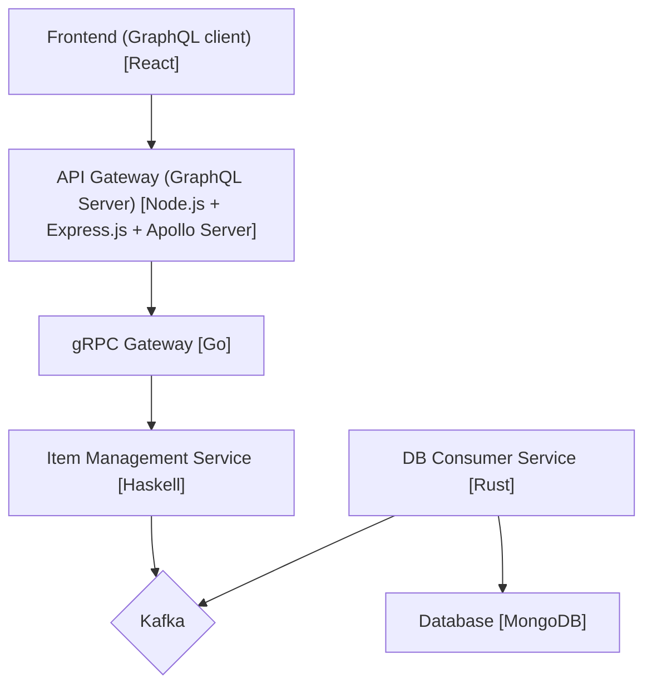

# GTD app

## Functional Requirements

### The five important use cases

The users of the app:
1. can capture stuff into Inbox
2. can clarify captured stuff quickly
3. can organize clarified items into the right places:
  - Trash
  - Someday/maybe
  - Reference
  - Project
  - Waiting for
  - Calendar
  - Next action
4. can reflect their actual situation to the app by performing Daily, Weekly, and Monthly reviews
5. can engage in what they should do using:
  - "Next action" list
  - Calendar
  - Levels of Focus

### Other functions

The user of the app
- can use the app from web browsers and as a mobile app on various devices (desktop, tablet, and mobile)
- can log in to the app using Social Auth (e.g., Google, Facebook, Twitter)
- can integrate the app's calendar with their Google Calendar
- can use the app from web browsers on various devices (desktop, tablet, and mobile)

## Non-functional requirements

### Performance

- This app can handle XX simultaneous requests (provide a specific number)
- This app responds to each request within 0.5 seconds

### Security

- Access control: Users authenticated with social login can use all functions of the app
- Data encryption:
  - This app does not store any authentication information because authentication is provided via social login
  - Sensitive user data is encrypted at rest and in transit

### Data backup:

This app backs up every user's data daily.

### Scalability

This app can scale out components that restrict the overall throughput.

### Usability

- Supported browsers:
  - Google Chrome v112.0 or later
- Misc functions:
  - Undo/redo functionality
  - Sorting by specified columns in each list

## Technical Stack

- Cloud Provider: Oracle Cloud
- Application Runtime Platform: Kubernetes
- CI/CD: GitHub Actions
- Programming Languages (Frameworks):
  - Backend: Go
  - Frontend: TypeScript (React)
- Middlewares:
  - RabbitMQ
  - PosgreSQL
  - BackBalancer
- Networking:
  - Between backend services: gRPC
  - Between backend and frondend services: GraphQL

## Architecture

The architecture of this application is Microservice Architecture

## How to Deploy Application

This application runs on Kubernetes (k8s) cluster.

#### Required Tools

- [Docker](https://www.docker.com/): to deploy kind cluster
- [kubectl](https://kubernetes.io/docs/tasks/tools/#kubectl): to manage k8s resources
- [SOPS](https://github.com/mozilla/sops): to encrypt/decrypt sensitive information

### Deploying infrastructure

Before deploying each micro service, provision k8s cluster first by executing `make infra-{env}-apply`

I configured two environments below:
- 'dev': provisioned on local machine using [kind](https://kind.sigs.k8s.io/)
- 'prd': TBD

### Deploying Microservices

You can deploy microservices by executing `make app-{env}-apply`
